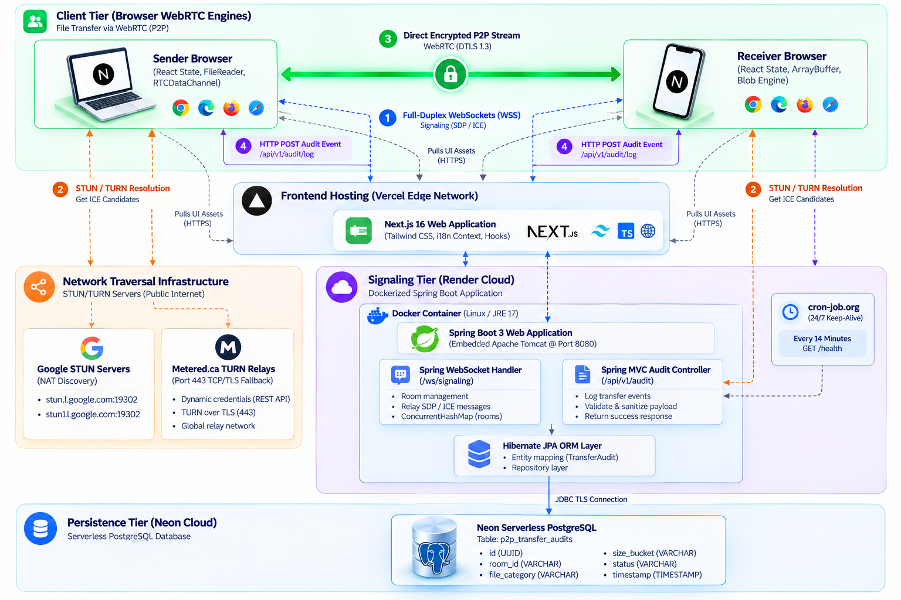
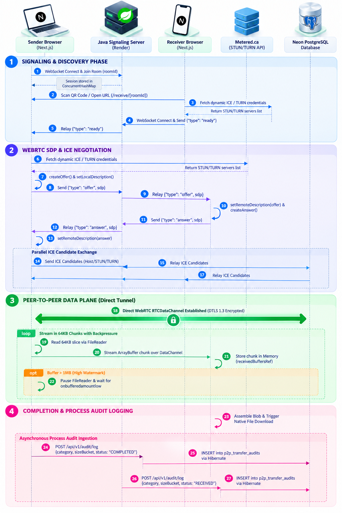
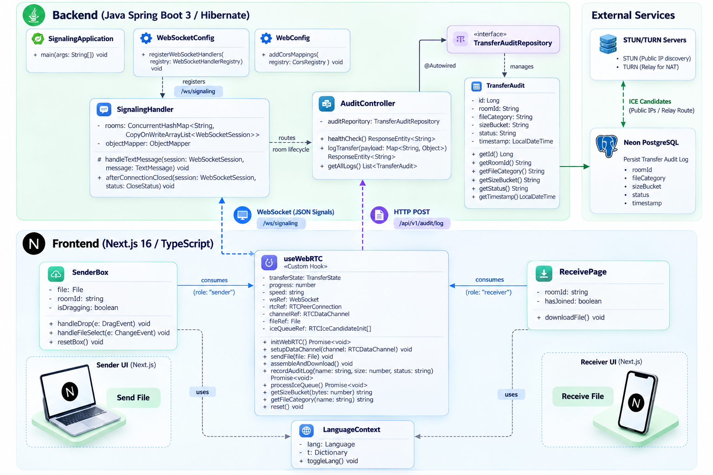

# 🍬 CandyShare
### *Decentralized, Zero-Cloud Peer-to-Peer File Transfer*

 

-4169E1?style=flat-square&logo=postgresql&logoColor=white)

 

**CandyShare** is a browser-native, zero-cloud file-streaming platform designed to transfer files of arbitrary size directly between edge devices. By decoupling data transmission from server storage, payloads stream directly from sender memory to receiver memory over encrypted WebRTC data channels, backed by a Java Spring Boot WebSocket signaling plane and an anonymized PostgreSQL process audit engine.

---

## 📑 Table of Contents
- [Key Architectural Highlights](#-key-architectural-highlights)
- [System Architecture & Deployment](#-system-architecture--deployment)
- [End-to-End Sequence Lifecycle](#-end-to-end-sequence-lifecycle)
- [Class & Component UML Model](#-class--component-uml-model)
- [Engineering Challenges & Breakthroughs](#-engineering-challenges--breakthroughs)
- [Technology Stack](#-technology-stack)
- [Local Development & Setup](#-local-development--setup)
- [Author & License](#-author--license)

---

## ⚡ Key Architectural Highlights

* 🔒 **Zero-Knowledge & Zero Server Storage:** File bytes never touch intermediate disks or cloud storage. Payload streaming is negotiated peer-to-peer with hardware-enforced **DTLS 1.3** end-to-end encryption.
* 🚀 **LAN Gigabit Acceleration:** Prioritizes local Host ICE candidates over STUN/TURN relays. Peers sharing a Wi-Fi subnet stream data at physical router throughput (**50–100+ MB/s**) with 0 MB internet quota consumption.
* 🌊 **Adaptive Backpressure Control:** Regulates client-side `FileReader` chunk ingestion using a 1MB high-watermark buffer threshold (`bufferedAmountLowThreshold`), eliminating browser out-of-memory crashes on multi-gigabyte transfers.
* 🌐 **Multi-Tiered NAT Traversal:** Integrates Google STUN discovery with dynamic **Metered.ca TURN relays** over Port 443 TCP, bypassing strict Carrier-Grade NATs (CGNAT) and mobile deep-packet-inspection firewalls.
* 📊 **Privacy-Preserving Process Audit Engine:** Implements an enterprise event-logging pipeline using **Spring Data JPA, Hibernate, and Neon PostgreSQL**. Categorizes transfers into MIME types and logarithmic size buckets (`< 1MB`, `1MB–100MB`) to provide structured telemetry for Process Mining analytics without storing sensitive metadata.
* 🌍 **Bilingual & Responsive Interface:** Built with Next.js 16, TypeScript, and Tailwind CSS v4, supporting English and Hindi via zero-dependency client state context.

---

## 🏛️ System Architecture & Deployment

The platform follows a decoupled micro-architecture separating the **Data Plane** (WebRTC P2P streams) from the **Control Plane** (Spring Boot WebSocket signaling) and **Persistence Plane** (Neon PostgreSQL).

  

### Architectural Tiers:
1. **Client Tier (Browser WebRTC Engines):** Executes file slicing, chunk streaming over `RTCDataChannel`, in-memory buffer reassembly, and native blob generation.
2. **Frontend Hosting (Vercel Edge Network):** Serves the statically optimized Next.js 16 single-page application and manages dynamic TURN credential provisioning.
3. **Signaling Tier (Render Cloud):** Multi-stage Dockerized Java 17 / Spring Boot service managing full-duplex WebSocket connections (`/ws/signaling`) and ephemeral room states via `ConcurrentHashMap`. Maintained with 24/7 uptime via automated keep-alive probes.
4. **Network Traversal Tier:** Distributed STUN/TURN infrastructure (Google STUN + Metered.ca REST API) executing interactive connectivity checks over UDP and Port 443 TCP/TLS.
5. **Persistence Tier (Neon Cloud):** Serverless PostgreSQL storing immutable lifecycle records (`p2p_transfer_audits`) via Hibernate ORM.

---

## 🔄 End-to-End Sequence Lifecycle

The dynamic lifecycle of a CandyShare session decouples session signaling, network route resolution, payload transmission, and audit logging into four discrete phases:

  

### Lifecycle Breakdown:
1. **Signaling & Discovery Phase:** 
   * Sender establishes a full-duplex WebSocket session with Spring Boot and creates an isolated room.
   * Receiver scans the QR code, resolves dynamic TURN credentials, and signals readiness (`{"type": "ready"}`).
2. **SDP & ICE Negotiation Phase:** 
   * Sender generates an **SDP Offer** defining transport codecs and cryptographic parameters; Receiver responds with an **SDP Answer**.
   * Both clients discover and exchange candidates across Local (Host), Public (STUN), and Relay (TURN) network paths.
3. **P2P Data Plane (Direct Tunnel):** 
   * A direct, encrypted `RTCDataChannel` opens. The Java server steps out of the data path.
   * Payloads are sliced into **64KB chunks**, streamed sequentially, and throttled via client backpressure listeners (`onbufferedamountlow`).
4. **Completion & Process Audit Ingestion:** 
   * Receiver stitches binary chunks into a `Blob` and triggers automatic browser download.
   * Both clients asynchronously dispatch anonymized event logs (`POST /api/v1/audit/log`), which are ingested into PostgreSQL via Hibernate.

---

## 📐 Class & Component UML Model

The structural design leverages Object-Oriented principles, Spring Data JPA abstractions, and React Hook state encapsulation:

  

### Core Modules:
* `SignalingHandler`: Extends Spring's `TextWebSocketHandler` with thread-safe data structures (`ConcurrentHashMap<String, CopyOnWriteArrayList<WebSocketSession>>`) to guarantee race-condition-free room orchestration.
* `AuditController` & `TransferAuditRepository`: Implements REST endpoints and extends `JpaRepository` for auto-generated, type-safe database queries.
* `useWebRTC`: Encapsulates all browser-level WebRTC networking, ICE queue buffering, and backpressure chunk streaming behind a declarative hook interface.

---

## 🛠️ Engineering Challenges & Breakthroughs

### 1. Producer-Consumer Buffer Overflow (The 12% Hang)
* **Problem:** Disk `FileReader` read speeds (~500 MB/s) drastically outpaced network socket throughput (~15 MB/s), flooding the browser's `RTCDataChannel` queue and crashing large transfers at 12%.
* **Solution:** Implemented **Adaptive Backpressure**. Monitored `channel.bufferedAmount` against a 1MB high watermark, suspending file reading until `bufferedAmountLowThreshold` (64KB) signals queue availability.

### 2. Social Media Link Preview Crawler Hijacking
* **Problem:** Sharing session links over WhatsApp/iMessage caused background headless crawlers to load the page, prematurely joining rooms and consuming SDP offers before the human recipient opened the tab.
* **Solution:** Introduced a client-side **User Consent Gate** (`hasJoined`), suspending WebSocket signaling until explicit user confirmation ("Accept Transfer").

### 3. Asynchronous ICE Candidate Race Conditions
* **Problem:** On high-latency mobile networks, ICE candidates arrived at the client before the SDP Offer/Answer Promise resolved, triggering browser `InvalidStateError`.
* **Solution:** Engineered an in-memory candidate buffer (`iceQueueRef`) that queues premature candidates and flushes them atomically after `setRemoteDescription()` resolves.

### 4. Symmetric Carrier-Grade NAT (CGNAT) Traversal
* **Problem:** Mobile cellular networks (Jio/Airtel) randomize public ports per destination, mathematically preventing STUN hole-punching and blocking UDP streams.
* **Solution:** Integrated dynamic REST provisioning of enterprise TURN relays with **Port 443 TCP transport fallback**, encapsulating SCTP packets in TLS-compliant streams.

---

## 🧰 Technology Stack

| Layer | Technologies Used |
| :--- | :--- |
| **Frontend Framework** | Next.js 16 (App Router), React 19, TypeScript 5 |
| **Styling & UI** | Tailwind CSS v4, Lucide Icons, QR Code SVG |
| **P2P & Transport** | WebRTC `RTCDataChannel`, SCTP, DTLS 1.3, STUN/TURN (Metered.ca API) |
| **Backend Microservice**| Java 17, Spring Boot 3.3+, Spring WebSockets |
| **ORM & Database** | Hibernate 6, Spring Data JPA, PostgreSQL (Neon Serverless) |
| **Containerization & Cloud** | Docker (Multi-stage JRE), Render Web Services, Vercel Edge, cron-job.org |

---

## 👤 Author & Acknowledgments

**Hemant Verma**
National Institute of Technology (NIT) Rourkela

**LinkedIn:** linkedin.com/in/hemant-verma-ind
**GitHub:** @Hemantidea